# Complete Smart Home System with Enhanced Safety Features

An IoT smart-home graduation project with embedded safety modules, PCB design, MQTT communication, Python server, database, Flutter mobile app and custom mechanical designs.

It was designed for home automation and safety-oriented monitoring for fire, flooding, motion, door opening, temperature, alarms, electrical loads, and power availability.

> The original implementation used a MQTT broker locally configured, a Python server, a database and hardware modules based on ESP8266. To reproduce live functionality, the local environment must be rebuilt and configured.

## Project resources

- [Android application release](../../releases/latest)
- [Mechanical designs on GrabCAD](https://grabcad.com/library/complete-smart-home-system-with-enhanced-safety-features-1)
- [Final project report](https://drive.google.com/file/d/1AwJD1UMMyeOQV9r7DHtg-fEgsQMXAIIb/view?usp=sharing)
- [Academic poster](https://drive.google.com/file/d/1HJPEl7pNxOwpySByrP_OhR2CXyU3-c1F/view?usp=sharing)
- [Final presentation](https://drive.google.com/file/d/1ijiyFpCKpJ4Y58pfwwHIocHStm_BWEi7/view?usp=sharing)

## System overview

The project is based on ESP8266 modules connected over a local network. MQTT allows messages exchange between hardware, Python server and mobile application. The server interfaces with the database of the project.

<p align="center">
  <a href="docs/project-overview/All%20in%20One%20Schematic.jpg">
    
  </a>
</p>

<p align="center">
  <em>Click the preview to open the full-resolution system schematic.</em>
</p>

## Main modules

The system was organized into ten functional modules:

1. **Dual Channel Relay** — control of two connected electrical loads.
2. **UPS** — backup power.
3. **Fire Detection Module** — fire hazard detection.
4. **IR Transceiver Module** — infrared control of compatible appliances.
5. **Motion Detection Module** — motion monitoring.
6. **Alarm Module** — audible alarm control.
7. **Temperature Module** — environmental temperature monitoring.
8. **Flood Detection Module** — water and flooding detection.
9. **Door Opening Detection Module** — door-opening monitoring.
10. **Power Meter Module** — electrical power-monitoring interface.

### Firmware availability

Firmware source code is only provided for **Alarm Module** and **Flood Detection Module** as a sample of representative implementations. The original firmware of the other eight modules is not found in the archived project files.

The two examples included are not the full firmware needed to run the full ten-module system.

## Mobile application

The Android app was developed using Flutter. It gives interfaces to configure the server, to communicate with MQTT, to control modules, to send notifications, and to change system settings.

Android build is available from the [latest GitHub Release](../../releases/latest).

### Selected application screens

<p align="center">
  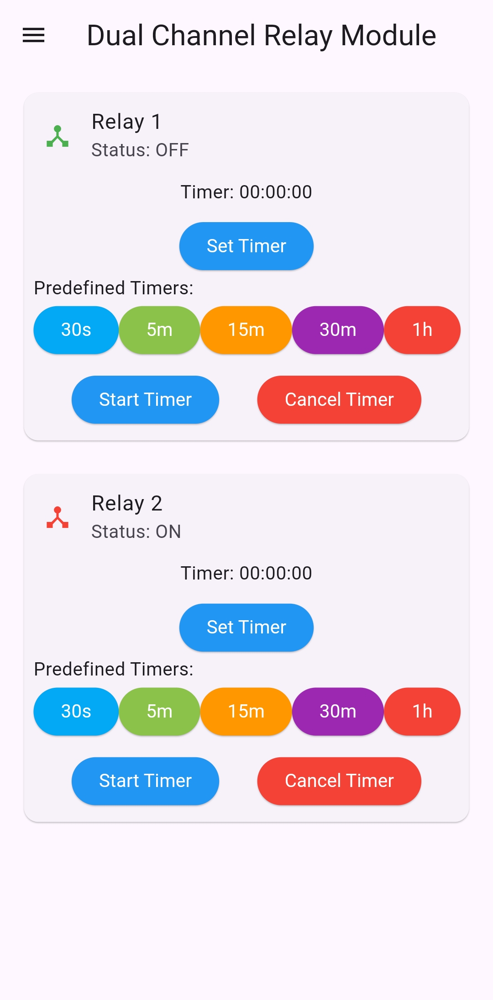
  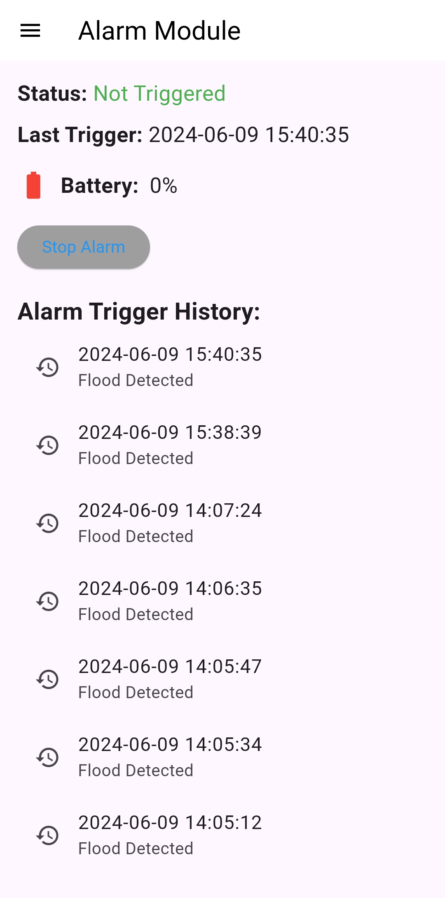
  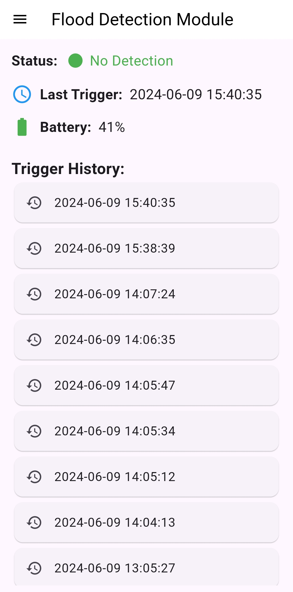
  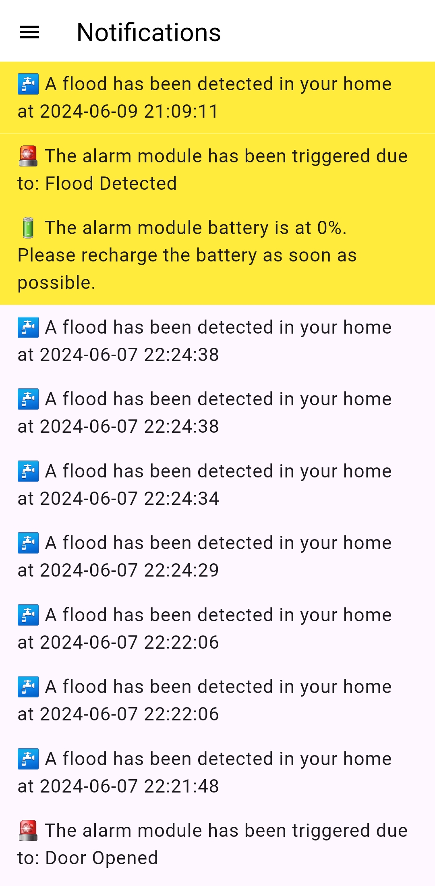
</p>

<p align="center">
  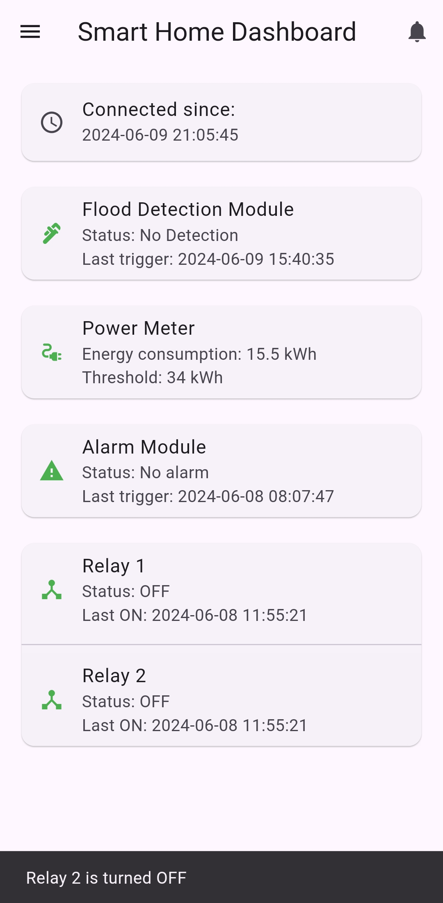
  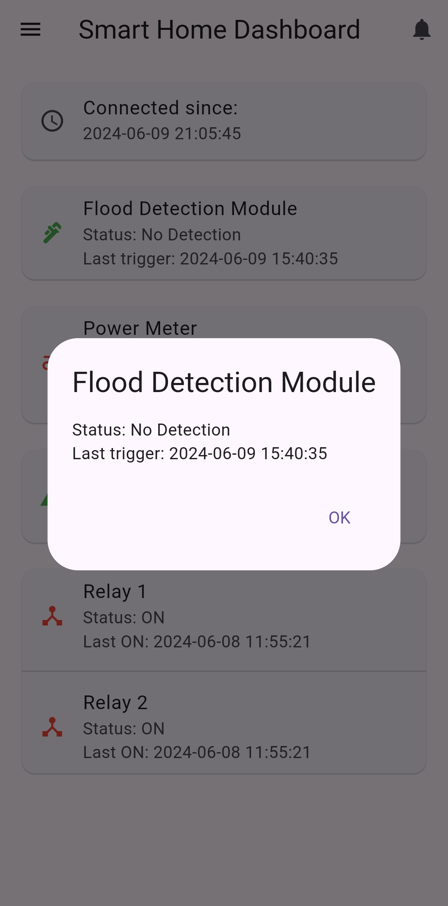
  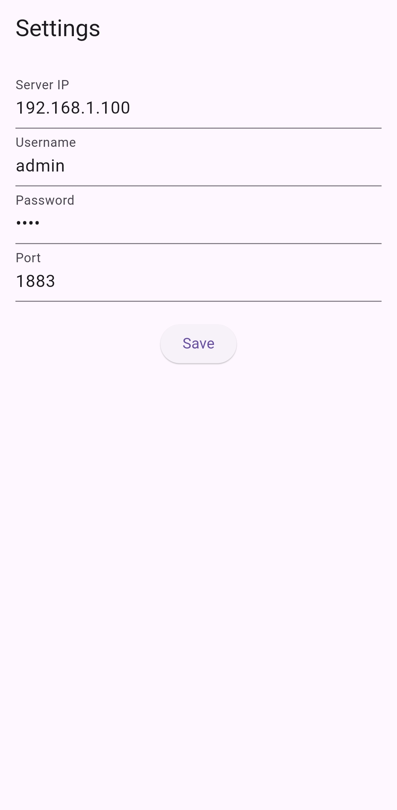
  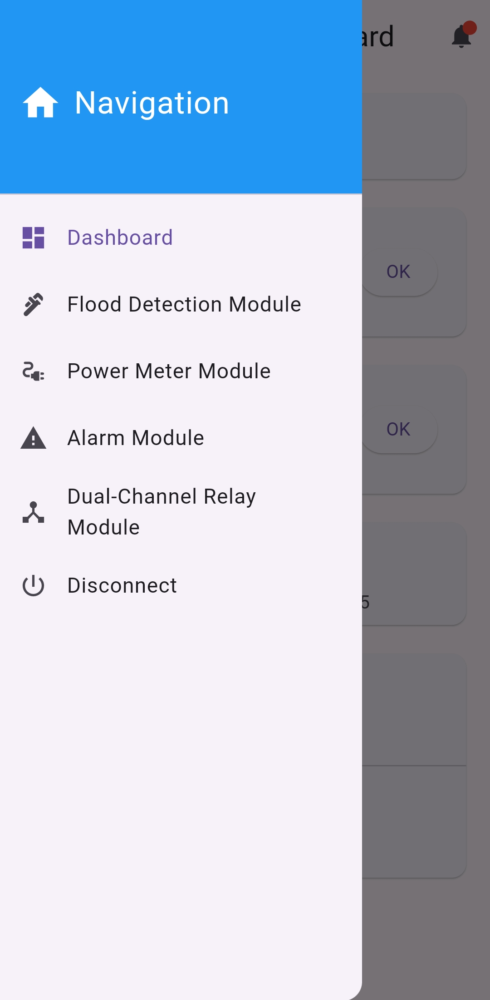
</p>

### Device connection interface

The ESP8266 modules used browser-based setup pages for entering Wi-Fi and MQTT connection details.

<p align="center">
  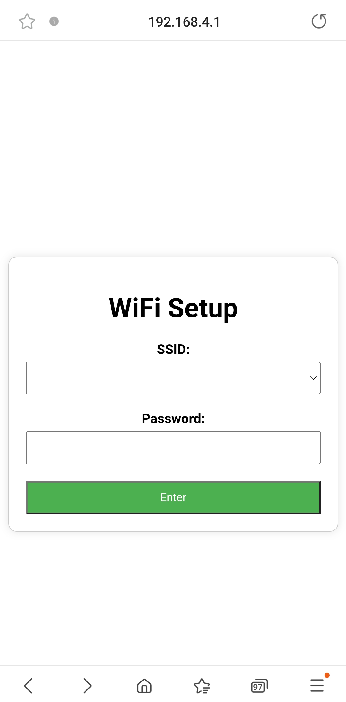
  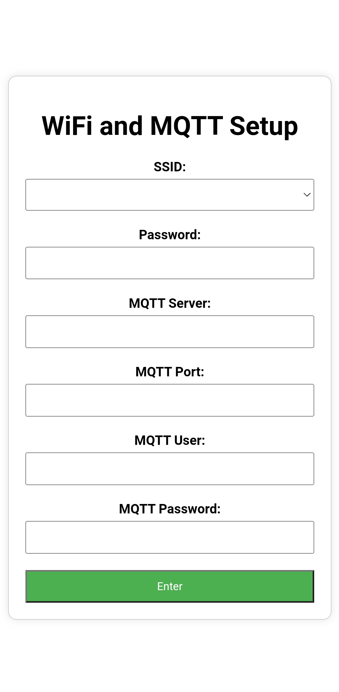
  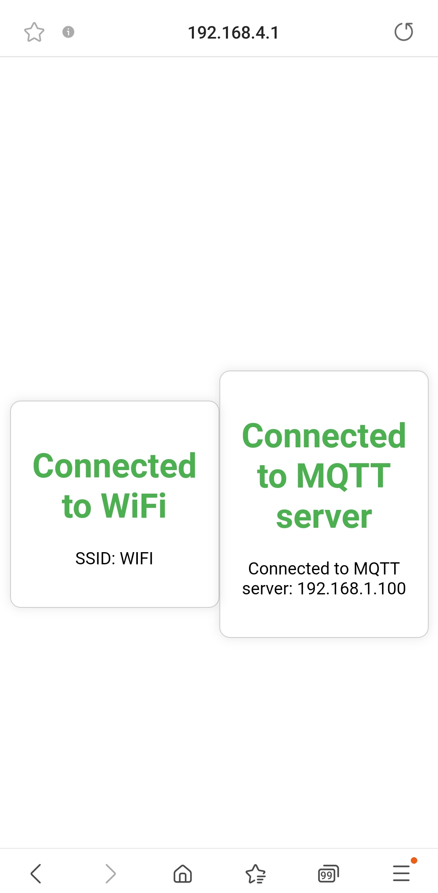
</p>

## Hardware and PCB documentation

For each module the electrical schematics, PCB source files and board previews are available in the `hardware/modules/` directory.

Mechanical CAD, enclosure assemblies, and printable files are published separately on [GrabCAD](https://grabcad.com/library/complete-smart-home-system-with-enhanced-safety-features-1).

## Running the archived project

### Flutter application

Requirements:

- Flutter SDK
- Android SDK
- a compatible Java Development Kit
- an Android device or emulator

From the Flutter project directory:

```bash
cd mobile-app/smarthome
flutter pub get
flutter analyze
flutter run
```

This project was created with an older version of Flutter/Android toolchain, and may require dependency or gradle updates on current development environments.

### Python server

The entry point of the server is:

```text
server/script.py
```

To reconstruct the original environment:

1. Create a Python environment.
2. Install the packages referenced by the imports in `script.py`.
3. Configure a local MQTT broker.
4. Recreate the project database using the schema image.
5. Replace the archived local addresses and credentials with your own configuration.
6. Run the server on the same network as the application and ESP8266 modules.

### ESP8266 firmware examples

The provided firmware examples can be opened in the Arduino IDE. Before compiling each sketch, install the board support and libraries referenced.

The firmware uses local Wi-Fi, MQTT, server and certificate settings. These values have to be replaced before reuse.

## Application and archive limitations

- Live functionality requires reconstruction of the original local environment.
- Only two of the ten firmware projects are available.
- The power-meter interface contains simulated data only, not real data.

## Archival security notice

This repository stores original local credentials, certificates, and private-key files for historical documentation.

Anyone adapting this project must:

- replace all usernames and passwords
- change broker, server, and database addresses
- generate new certificates and cryptographic keys
- apply current security practices before deployment
